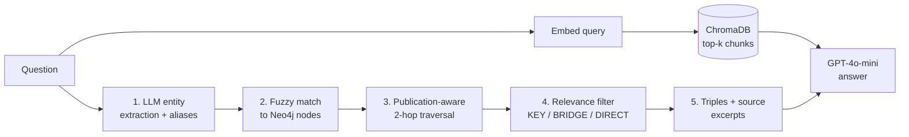

# From Vector RAG to GraphRAG

**A comparative study of retrieval architectures for multi-hop question answering**

CS564 (Database Management Systems) Final Project, University of New Mexico
Alekh Pandey, Scott Bing

---

## Overview

Standard RAG embeds the question and pulls back the top-k most similar chunks from a vector store. That works when one document holds the answer. It breaks down on **multi-hop** questions, where the answer is only found by connecting facts spread across several documents. For example, *"Who is the CEO of the company that Paradigm invested in?"* needs `Paradigm → INVESTED_IN → FTX`, then `SBF → CEO_OF → FTX`.

This project builds two retrieval pipelines over the same news corpus and compares them head to head on the **[MultiHop-RAG](https://arxiv.org/abs/2401.15391)** benchmark:

| | **Vector RAG** (baseline) | **Graph RAG** |
|---|---|---|
| Store | ChromaDB | Neo4j knowledge graph |
| Index | `text-embedding-3-small` chunk embeddings | 6,935 nodes / 21,625 typed edges extracted with GPT-4o |
| Retrieval | Single-pass similarity search | Deterministic 5-stage Cypher pipeline |
| Generator | GPT-4o-mini | GPT-4o-mini (same prompt) |

Both systems use the same LLM and the same answer prompt, so **the retrieval method is the only variable being tested**.

## Key Results

Evaluated on **200 questions**, 50 from each of the four MultiHop-RAG categories.

| Metric | Vector RAG | Graph RAG |
|---|---|---|
| **Accuracy** | 79.5% (159/200) | **82.5% (165/200)** |
| Miss rate (says "Unknown" when an answer exists) | 18.7% | **4.7%** |
| Hallucination rate (answers a null query) | **6.0%** | 14.0% |
| Retrieval recall | 42.9% | **53.7%** |
| Retrieval precision | **57.7%** | 35.0% |
| Mean / median latency | **0.86s / 0.65s** | 2.02s / 1.93s |

### Accuracy by question type

| Category | Vector RAG | Graph RAG | Δ |
|---|---|---|---|
| Inference | **94.0%** | 90.0% | −4.0 |
| Comparison | 70.0% | **84.0%** | **+14.0** |
| Temporal | 60.0% | **70.0%** | **+10.0** |
| Null | **94.0%** | 86.0% | −8.0 |

### Takeaways

- **Graph RAG wins where multi-hop reasoning matters.** Comparison and temporal questions ask what *publication A* said versus *publication B*. The graph's `REPORTED_BY` edges act as a structural index from entities to specific outlets, which similarity search can't provide.
- **The precision-recall paradox.** Vector RAG has higher retrieval precision and F1, yet Graph RAG answers more questions correctly. When Graph RAG misses the exact ground-truth document, the knowledge-graph triples still give the LLM a path to reason along. When Vector RAG's top-k misses, the LLM has nothing to work with, which explains its 18.7% miss rate.
- **Graph RAG is better at finding answers but also more willing to make them up.** Fuzzy entity matching sometimes latches onto a node for a question that has no answer in the corpus, so it hallucinates more on null queries.
- **Latency costs about 2.3×.** Graph RAG adds an entity-extraction LLM call plus several sequential Cypher queries.
- For context, Tang & Yang report 56% accuracy for GPT-4 with retrieved chunks and 89% with ground-truth chunks on this benchmark. At 82.5%, Graph RAG closes most of that retrieval gap.

## Architecture



### Knowledge graph construction

1. **Data-driven schema.** We analyzed the benchmark queries and found that 84% name a specific publication and 54% name two or more. From that we designed **9 node types** (Person, Organization, Publication, Product, CreativeWork, Location, Event, LegalCharge, Award) and **19 specific edge types** (`REPORTED_BY`, `CEO_OF`, `INVESTED_IN`, `SUED`, `CHARGED_WITH`, `TESTIFIED_IN`, …). The schema has no catch-all edges such as `ASSOCIATED_WITH`. See [`src/scripts/schema_v2.json`](src/scripts/schema_v2.json).
2. **Metadata-enriched chunking.** Each 1,000-character chunk (150 overlap) is prefixed with `[Source | Title | Published]` so the extractor can emit `REPORTED_BY` edges.
3. **Schema-enforced extraction.** LangChain's `LLMGraphTransformer` runs GPT-4o restricted to the allowed labels, and the full node and edge descriptions are passed as additional instructions.
4. **Post-ingestion enrichment.** A publication-edge safety net, entity deduplication, publication merging, and a temporal layer of `Date` nodes.

### Graph retrieval

Retrieval uses **fixed, deterministic Cypher templates** rather than LLM-generated Cypher.

1. **Entity extraction.** GPT-4o-mini pulls out proper nouns and aliases, e.g. `Sam Bankman-Fried → [SBF]`.
2. **Fuzzy matching.** A three-tier score (exact, then prefix, then substring) plus a coverage threshold of 30% or more, which stops matches like "Hype" → "Hyperscalers".
3. **Publication-aware traversal.** For a Publication node, only entities that also connect to another query entity are returned, so the traversal doesn't pull in everything TechCrunch ever covered. Other nodes get a standard two-hop neighborhood.
4. **Relevance filtering.** Triples are capped at 60 and ranked as *key* (entity↔entity, ≤10), *bridging* (≤30), or *direct* (≤20).
5. **Answer generation.** The prompt combines graph facts (tagged `[KEY]`) with document excerpts reached through `MENTIONS` edges.

## What didn't work

- **LLM-generated Cypher** (`GraphCypherQAChain`) reached about 10% accuracy, and over 90% of its answers were "Unknown". The LLM kept writing `WHERE d.text CONTAINS 'keyword'`, which treats the graph as a text search engine instead of traversing it.
- **Generic LLM-proposed schema.** Catch-all edges swallowed most relationships. *Amazon* ended up labeled as Organization, Concept, Product, Service, and Location all at once.
- **Edge labels without descriptions.** The extractor kept confusing `CEO_OF` with `WORKS_FOR` and `INVESTED_IN` with `OWNS`.
- **No Publication node.** Without it, the 84% of queries that name an outlet were effectively unanswerable.

## Repository Structure

```
.
├── run_rag.py                      # Runs Vector / Graph / Hybrid RAG over the test set
├── evaluate_results.py             # Accuracy, hallucination, miss rate, P/R/F1, latency
├── exp.ipynb                       # Experiments and analysis notebook
├── populate_vectors.ipynb          # Builds the ChromaDB vector store (notebook version)
├── data/
│   └── sample_queries.json         # The 200 evaluation questions (50 per category)
├── results/
│   ├── final.json                  # Per-question answers, latencies, retrieved titles
│   └── evaluation.json             # Aggregated metrics (source of the tables above)
├── src/
│   ├── configs/config.py           # Pydantic settings (reads .env)
│   ├── db/                         # ChromaDB and Neo4j connection singletons
│   ├── bots/
│   │   ├── models.py               # Vector RAG (single-pass)
│   │   ├── graph_retrieval_v3.py   # Graph RAG, 5-stage retriever
│   │   └── hybrid_retrieval.py     # Graph-guided vector search (extra experiment)
│   └── scripts/
│       ├── schema_v2.json          # Final 9-node / 19-edge graph schema
│       ├── prepare_evidence_corpus.py
│       ├── graph_transformer_v2.py # KG extraction pipeline (GPT-4o)
│       ├── retry_failed_chunks.py
│       ├── merge_duplicate_publications.py
│       ├── enrich_node_properties.py
│       ├── add_temporal_edges.py
│       └── build_knowledge_vector.py
└── multihoprag/                    # Early prototype: Neo4j vector index + Streamlit UI
```

## Reproducing

**Prerequisites:** Python 3.11+, a running Neo4j 5.x instance, and an OpenAI API key.

```bash
git clone https://github.com/CodeAlekh/<repo-name>.git
cd <repo-name>
python -m venv .venv && source .venv/bin/activate
pip install -r requirements.txt

cp .env.example .env   # then fill in your keys
```

**1. Get the data.** Download `corpus.json` and `MultiHopRAG.json` from [yixuantt/MultiHopRAG](https://huggingface.co/datasets/yixuantt/MultiHopRAG) into `data/`. The 200-question evaluation sample is already in `data/sample_queries.json`.

**2. Build the vector store** (ChromaDB, persisted to `db/`):

```bash
python -m src.scripts.build_knowledge_vector
```

**3. Build the knowledge graph** in Neo4j. This calls GPT-4o on every chunk, so it costs money.

```bash
(cd src/scripts && python prepare_evidence_corpus.py)   # -> data/evidence_corpus.json
python -m src.scripts.graph_transformer_v2              # extraction + publication edges + dedup
python -m src.scripts.retry_failed_chunks               # optional: re-run rate-limited chunks
python -m src.scripts.merge_duplicate_publications
python -m src.scripts.add_temporal_edges
```

**4. Run and evaluate.**

```bash
python run_rag.py                                  # fills answers into results/test_set.json
python evaluate_results.py --input results/final.json --output results/evaluation.json
```

## Future Work

- Embedding-based entity deduplication instead of substring matching
- Use the temporal `Date` layer directly for date-aware retrieval
- Confidence thresholds on entity matches to lower the null-query hallucination rate
- Explore traversals deeper than 2 hops, and graph-guided hybrid retrieval

## References

1. Y. Tang and Y. Yang, *MultiHop-RAG: Benchmarking Retrieval-Augmented Generation for Multi-Hop Queries*, 2024. [arXiv:2401.15391](https://arxiv.org/abs/2401.15391)
2. D. Edge et al., *From Local to Global: A GraphRAG Approach to Query-Focused Summarization*, 2024. [arXiv:2404.16130](https://arxiv.org/abs/2404.16130)
3. Y. Gao et al., *Retrieval-Augmented Generation for Large Language Models: A Survey*, 2023. [arXiv:2312.10997](https://arxiv.org/abs/2312.10997)
